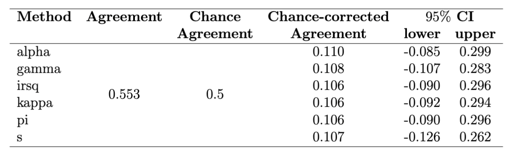
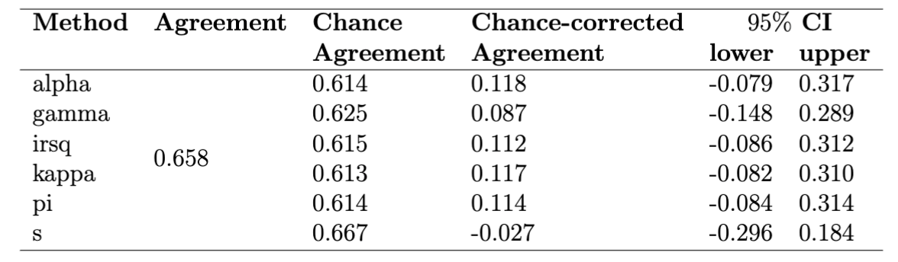
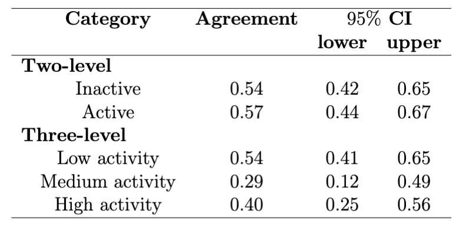

# Project Portfolio: Comparison of Self-Reported and Actigraphy-Measured Physical Activity in People Living with HIV

## Overview
This project aimed to compare self-reported physical activity measures with actigraphy-measured physical activity in people living with HIV (PLWH). The study collected data from 103 patients in the PROSPER-HIV study and analyzed the relationship between the two measures using chance-corrected agreement methods. 

## Objectives
The main objectives of this project were:
- To assess the concordance between self-reported LRCQ and actigraphy-measured physical activity in PLWH.
- To evaluate the accuracy of self-reported physical activity measures compared to actigraphy.
- To determine if self-reported measures can be used as a reliable substitute for actigraphy in future studies.

## Methods
The study collected data from 103 patients in the PROSPER-HIV study. Participants wore an ActiGraph accelerometer for seven consecutive days to measure their physical activity levels. They also completed a self-reported Lipid Research Clinics Physical Activity Questionnaire (LRCQ) during the same period. The relationship between these two measures was analyzed using chance-corrected agreement methods, including Krippendorff's Alpha Coefficient, Gwet's AC1 Coefficient, Cohen's (weighted) Kappa, Van Oest's Coefficient, Scott's Pi Coefficient, and Bennett's S-Coefficient.

## Results
The results showed that there was a weak agreement between self-reported LRCQ and actigraphy-measured physical activity levels among PLWH. The chance-corrected agreement statistic was 0.10 (95% CI: 0-0.30), indicating a random agreement(results in Table @fig:tbl1 and @fig:tbl2). 

The results of the category-specific agreement assessment, as presented in Table @fig:tbl3, indicate that both measures achieved similar agreements with the bootstrapped confidence interval ranging between 0.4 and 0.7 for both the active and inactive categories. Furthermore, the analysis revealed that the low activity and high activity categories demonstrated similar agreements between the two measures. However, the medium activity category showed lower agreement compared to the other two categories. This finding suggests that the LRCQ responses may be inaccurate when patients are in a state of medium physical activity.
{#fig:tbl1}
{#fig:tbl2}
{#fig:tbl3}

## Conclusion
Our findings highlight the need for caution in interpreting the results of studies using these measures interchangeably and underscore the importance of developing more valid and reliable questionnaires for measuring physical activity levels. The category-specific agreement assessment revealed that the LRCQ response and actigraphy measure achieved similar agreements for the active and inactive categories. However, the medium activity category showed lower agreement, indicating a potential inaccuracy in LRCQ responses when patients are in medium physical activity. These findings can help researchers and clinicians better understand the agreement and potential sources of disagreement or variability between the two measures.
